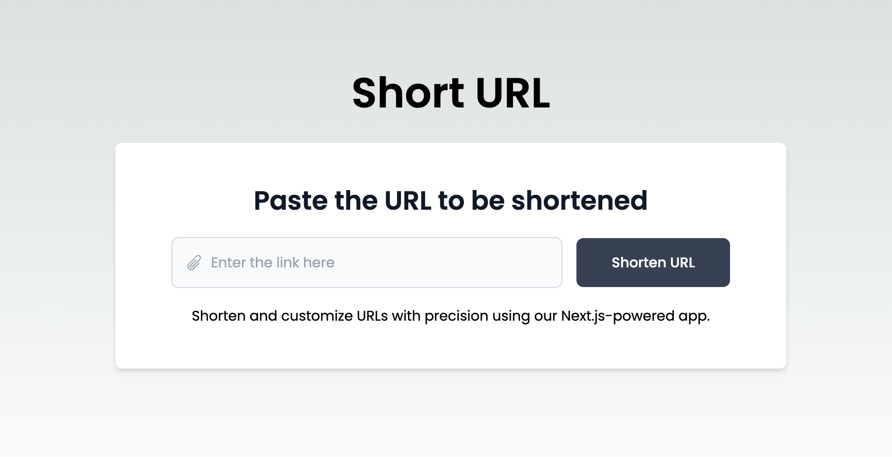

# Short URL Generator App using Next.js 14

## Overview

This project is a simple Short URL Generator App built with Next.js 14. It allows you to easily generate short URLs for long links. The application uses MongoDB to store the mapping between short and long URLs.

## Getting Started

To get started with the Short URL Generator App, follow the instructions below:

### Clone the Repository

```bash
git clone https://github.com/maheshbohara/nextjs-url-shortner.git
cd nextjs-url-shortner
```

### Install Dependencies

```bash
npm install
```

### Set up Environment Variables

Create a file named `.env.local` in the root of the project and add the following environment variables:

```env
MONGODB_URI=your_mongodb_uri
MONGODB_NAME=your_mongodb_database_name
NEXT_PUBLIC_BASE_URL=your_base_url
```

Replace `your_mongodb_uri`, `your_mongodb_database_name`, and `your_base_url` with your MongoDB connection URI, database name, and the base URL of your application, respectively.

### Run the Application

```bash
npm run dev
```

Open your browser and navigate to [http://localhost:3000](http://localhost:3000) to access the Short URL Generator App.

## Additional Information

Feel free to explore and customize the application further. You can add more features, improve the user interface, or enhance the functionality based on your requirements.



Happy coding!